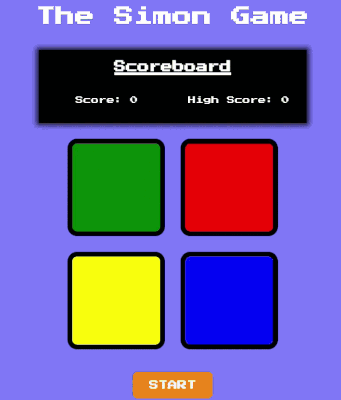

# Simon Game

A browser-based implementation of the classic **Simon Game**.

---

## About the Project

The objective is simple: memorize the sequence of colors displayed by the game and repeat it correctly. Each successful round adds a new color to the sequence until the player makes a mistake.

---

## Technologies Used

* HTML5
* CSS3
* Vanilla JavaScript
* Local Storage API
* DOM Manipulation
* Event Handling

---

## Features

* Classic Simon Game mechanics
* Randomly generated color sequences
* Live score tracking
* High score persistence using Local Storage
* Sound effects for game over
* Play Again functionality

---

## The Process

This project was developed to strengthen my understanding of logic.

---

## How to Play

1. Click the **Start** button.
2. Watch the sequence shown by the game.
3. Repeat the sequence by clicking the colored buttons.
4. Each successful round adds a new color.
5. The game ends if you click the wrong button.
6. Try to beat your highest score!

---

## Preview/Demo

---